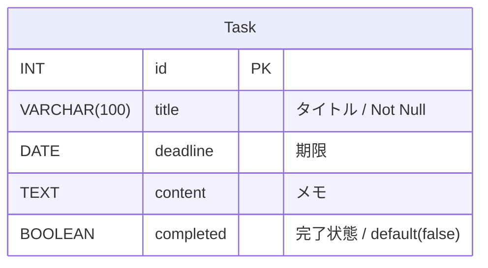
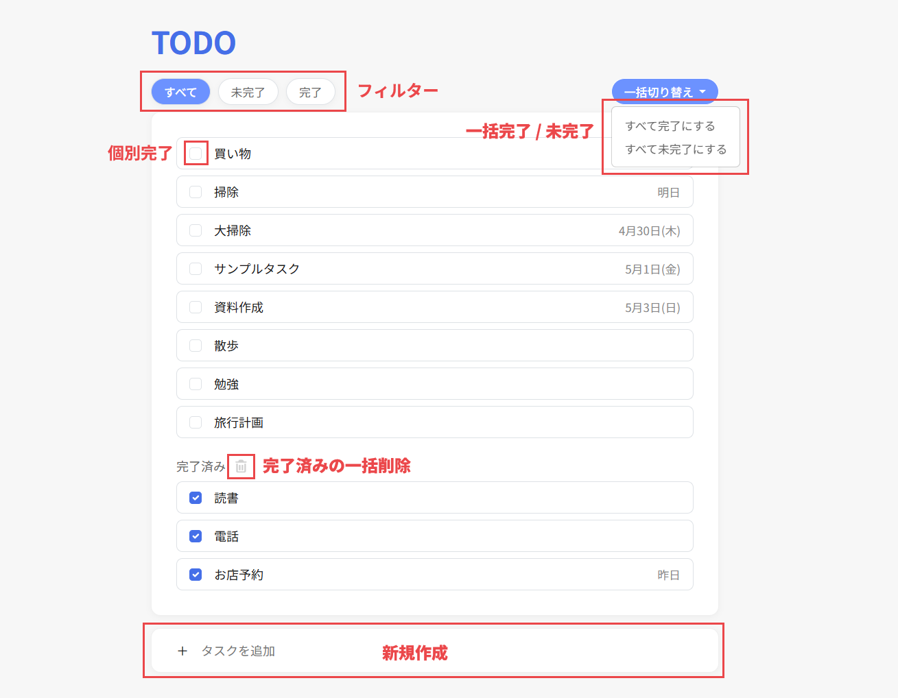

# TODO リスト

## 使用技術
- **使用技術** : Ruby 3.3.2, Ruby on Rails 7.2.3
- **環境構成** :
  - **OS** : Windows 11 + WSL2 (Ubuntu 24.04.3 LTS)
  - **DB** : PostgreSQL 16.13

## ビルド手順 / 実行手順
※ PostgreSQLがインストールされ、起動していることを確認してください
```bash
# リポジトリをクローン
$ git clone https://github.com/tsuki1006/todo-app.git
$ cd todo-app

# 実行手順
$ bundle install
$ bundle exec rails db:create
$ bundle exec db:migrate
$ bundle exec rails db:seed
$ bundle exec rails s

# サーバー起動後 http://localhost:3000 にアクセスしてください
```

## モデル

※Rails 標準の timestamps (created_at, updated_at) を含む

## 機能一覧
<table>
  <tr>
    <td>タスクの 新規追加 / 編集 / 削除 / 一覧表示</td>
  </tr>
  <tr>
    <td>タスクの 完了・未完了の個別切り替え / 一括切り替え</td>
  </tr>
  <tr>
    <td>完了済みタスクの一括削除</td>
  </tr>
  <tr>
    <td>フィルター表示（すべて / 未完了タスクのみ / 完了済みのタスクのみ）</td>
  </tr>
</table>

## 使用イメージ
|タスク一覧画面|タスク詳細画面|
|:---:|:---:|
||  |

## ルーティング
| Path | リクエスト | 内容 |
| :--- | :--- | :--- |
| / | GET | 一覧表示 |
| /tasks | POST | 新規追加 |
| /tasks/:id/edit | GET | 詳細表示（モーダル） |
| /tasks/:id | PATCH / PUT | 編集 |
| /tasks/:id | DELETE | 削除 |
| /tasks/:task_id/completion | PATCH / PUT | 個別完了 / 未完了 |
| /tasks/whole_completion | POST | 一括完了 |
| /tasks/whole_completion | DELETE | 一括未完了 |
| /tasks/completed_all | DELETE | 完了タスクの一括削除 |
